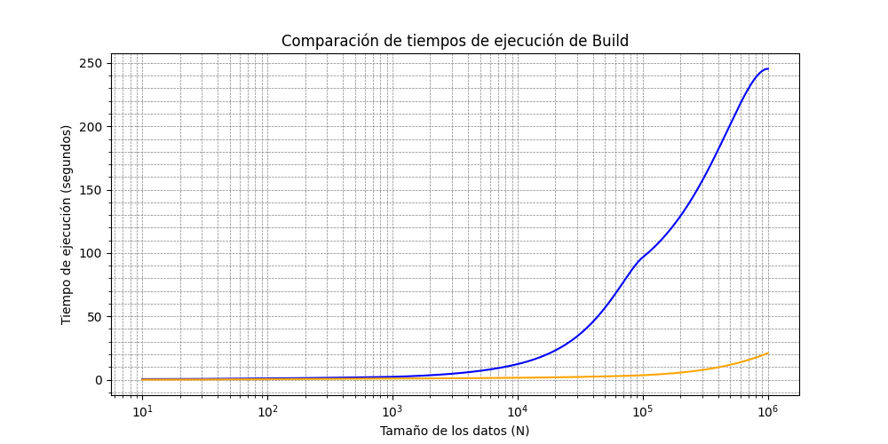
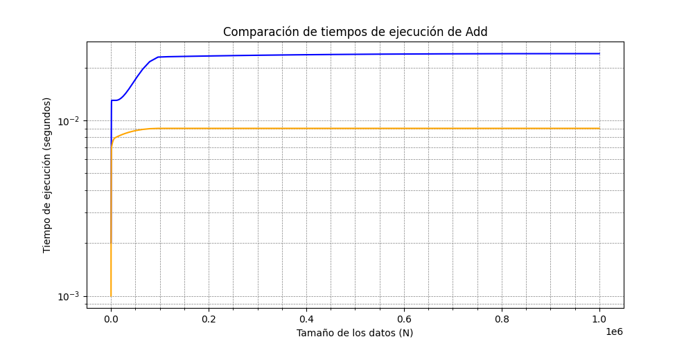
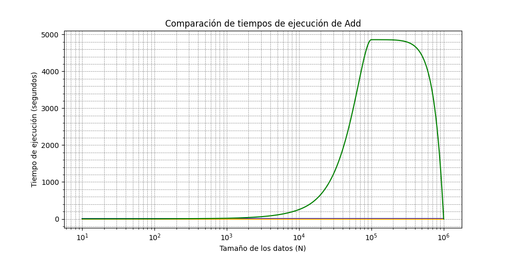
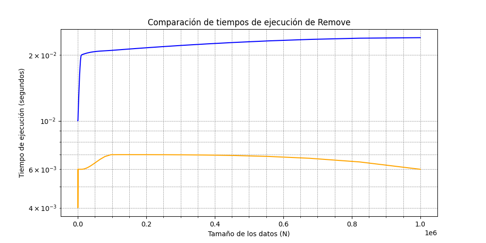
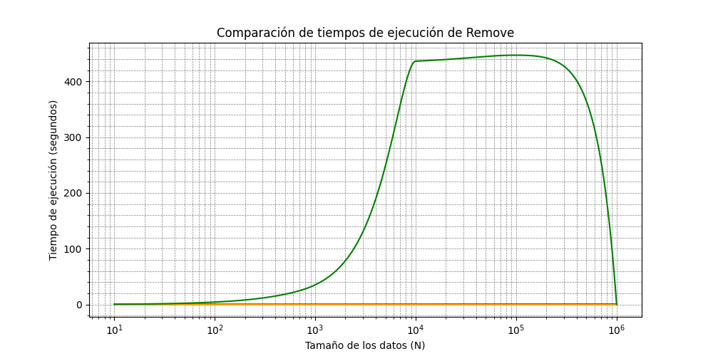
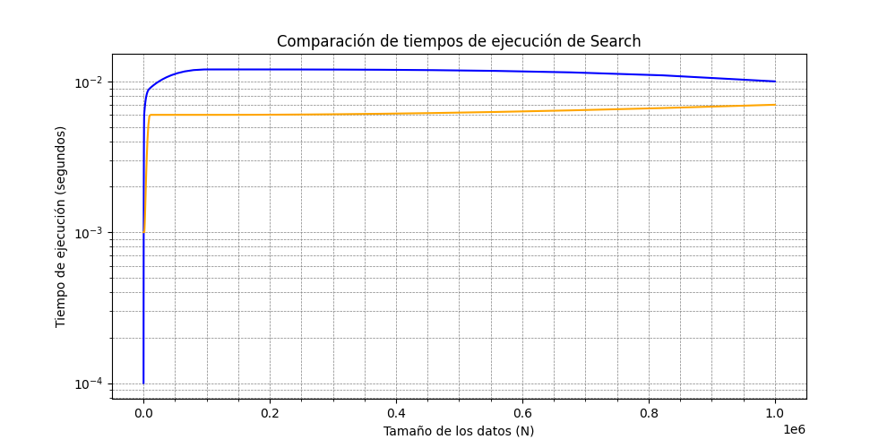
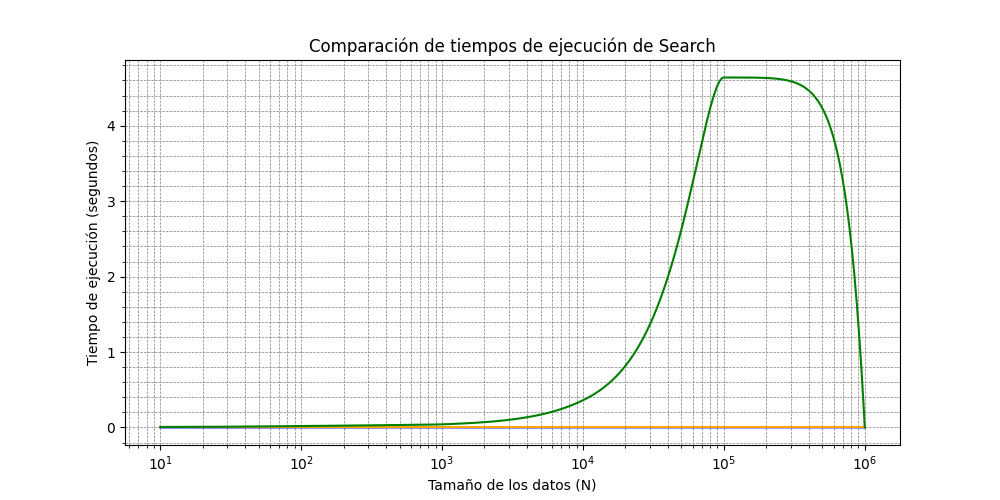
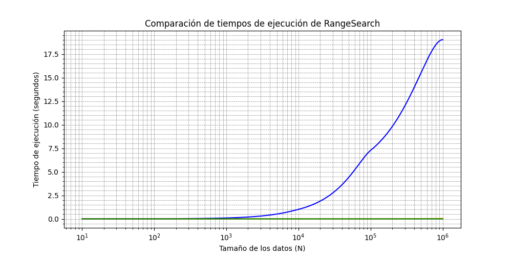

# Data Fusion DB - Proyecto 1

### Proyecto P1 - Base de datos II - Sección I

### Team

- Juan Aquino
- Claudio Echarre
- Piero Guerrero
- Marcelino Maita
- Aaron Navarro

---

El proyecto DataFusionDB consiste en la integración (**Fusion**) de diferentes modelos de datos y
técnicas avanzadas de organización de información dentro de una única base de datos (**DB**).
El propósito de construir una plataforma versátil que unifique datos estructurados y no
estructurados, incluyendo documentos textuales en principio para luego incluir objetos multimedia.

# Objetivos

### Generales

- Soporte de modelo relacional basado en tablas.
- Implementación de técnicas de organización de información.

### Específicos

- Implementación de un mini gestor de base de datos optimizado para la gestión de la información.
- Aplicación y comparación en tiempos de ejecución entre cada técnica de organización e indexación de archivos físicos.

# Técnicas de indexación y Organización de Archivos

Para la gestión de los archivos físicos, se eligieron 3 estrategias para la organización de archivos e índices.

- **_AVL File_**
- **_Sequential File_**
- **_Extendible Hashing Indexing_**

## AVL File

Un AVL File es una estructura de datos que implementa un árbol AVL (Adelson-Velsky y Landis) para
organizar archivos en memoria secundaria (como discos duros) de manera eficiente. Un árbol AVL es
un tipo de árbol binario de búsqueda que se mantiene balanceado mediante la aplicación de rotaciones
después de cada operación de inserción o eliminación, garantizando un tiempo de acceso logarítmico
$O(log n)$ en las operaciones de búsqueda, inserción y eliminación.

> [!IMPORTANT]
> Se optimizó los inserts y removes implementando un FreeList LIFO

### Estructuras

En el archivo físico, se tiene como cabecera, los datos del root y del último eliminado. Al iniciar la tabla, la
estructura **_HeadAVL_** tendrá los siguientes valores:

**HeadAVL** (size=8B)

| Root | NextDel |
| ---- | ------- |
| -1   | -1      |

Posterior al head, se guardan los registros con la siguiente estructura:
**NodeAVL** (size=16B+sizeof(Record))

| NextDel  | Left     | Right    | Height | Record    |
| -------- | -------- | -------- | ------ | --------- |
| -1(long) | -1(long) | -1(long) | 0(int) | record(R) |

### Algoritmos

> [!NOTE]
> Se optimizó la carga del buffer al escribir y leer en las posiciones físicas exactas para
> acceder a los índices de los hijos, altura, nextDel y data. De esta forma, no se sobrecarga
> el buffer con todo el registro.

#### **Insert(R record)**

1. Inserción en BST
   1. Insertar en nodo hijo izquierdo si es menor que el padre.
   2. O insertar en nodo hijo derecho si es mayor que el padre.
   3. No insertar elementos repetidos.
   4. Insertar si no hay más hijos que evaluar.
   5. Verificación si existe un registro eliminado.
      1. Se inserta en la posición física del registro eliminado.
      2. O se inserta al final de la tabla.
2. Actualización de alturas.
   1. Se actualiza todas las alturas desde el padre hasta la raíz.
3. Balanceo y rotaciones si es necesario.
   1. Se obtiene el factor de balanceo desde el padre hasta la raíz.
   2. Se evalúa el factor de balanceo:
      1. fb > 1 && key < node->left: rotación simple a la derecha
      2. fb < -1 && key > node->right: rotación simple a la izquierda
      3. fb > 1 && key > node->left: rotación doble (izquierda - derecha)
      4. fb < -1 && key < node->right: rotación doble (derecha - izquierda)

#### **Remove(T key)**

1. Eliminación en BST

   1. Buscar en hijo izquierdo, si key < node.
   2. Buscar en hijo derecho, si key > node.
   3. Eliminar si se encuentra.
   4. Nodo contiene dos hijos:
      1. Buscar sucesor y reemplazar el valor del nodo a eliminar con el sucesor.
      2. Eliminar sucesor en su ubicación original.
   5. Si el nodo a eliminar tiene un hijo o no tiene hijos:
      1. Si no tiene hijos, eliminar
      2. Si tiene un hijo, se redirecciona los índices del hijo al padre del nodo eliminado.
   6. FreeList
      1. Se copia el valor del nextDel en el registro eliminado.
      2. Se actualiza el nextDel del head con la posición del registro eliminado.

2. Actualización de alturas
   1. Actualizar las alturas desde el padre hasta la raíz.
3. Balanceo y rotaciones si es necesario
   1. Calcular el factor de balanceo desde el padre hasta la raíz.
   2. Evaluar el factor de balanceo:
      1. fb > 1 && key < node->left: rotación simple a la derecha
      2. fb < -1 && key > node->right: rotación simple a la izquierda
      3. fb > 1 && key > node->left: rotación doble (izquierda - derecha)
      4. fb < -1 && key < node->right: rotación doble (derecha - izquierda)

#### **Search (T key)**

Búsqueda en BST

1. Comenzar desde la raíz del árbol.
2. Comparar la clave key con el nodo actual:
   1. Si key es igual al valor del nodo, se ha encontrado el nodo. Retornar el nodo.
   2. Si key es menor que el valor del nodo, continuar la búsqueda en el subárbol izquierdo.
   3. Si key es mayor que el valor del nodo, continuar la búsqueda en el subárbol derecho.
3. Si se llega a un nodo null, significa que la clave no está en el árbol. Retornar false.

#### **RangeSearch**

1. Comenzar desde root.
2. Si el valor del null está dentro del rango [low, high]:
   1. Agregar el record a una lista de resultados.
   2. Continuar la búsqueda en ambos subárboles (izquierdo y derecho).
3. Si el valor del nodo actual es menor que low:
   1. Continuar la búsqueda solo en el subárbol derecho.
4. Si el valor del nodo actual es mayor que high:
   1. Continuar la búsqueda solo en el subárbol izquierdo.
5. Devolver la lista de resultados.

### Evolución de tiempos de ejecución

| seg         | N=10  | N=100 | N=1K   | N=10K   | N=100K   | N=1M(aprox) |
| ----------- | ----- | ----- | ------ | ------- | -------- | ----------- |
| buildTable  | 0.383 | 7.989 | 122.22 | 1556.27 | 17735.63 | 201655.4    |
| add         | 0.023 | 0.083 | 0.196  | 0.204   | 0.25     | 0.31        |
| search      | 0.001 | 0.001 | 0.002  | 0.002   | 0.002    | 0.002       |
| rangeSearch | 0.001 | 0.011 | 0.097  | 1.011   | 7.28     | 19.03       |
| remove      | 0.013 | 0.087 | 0.138  | 0.154   | 0.22     | 0.27        |

## Sequential File

Sequential File es una forma de organizar los registros entre dos archivos, uno principal(main) y otro auxiliar(aux), en el archivo principal están los registros ordenados en función de una clave(key), adicionalmente a la información de los registros, cada uno contiene información de la longitud del propio registro y un puntero lógico al siguiente elemento.

Consideraciones:

- Mantener el archivo (main) siempre ordenado
- Manejamos un atributo booleano 'IsInDataPage' para identificar a los registros que están en la página principal de datos.

#### **Insert(R record)**

Búsqueda del registro más cercano:

1. Se realiza una búsqueda binaria para encontrar el registro cuyo valor clave (key) es el más cercano al valor del registro que se va a insertar.
   - Avanzamos mediante el puntero lógico al siguiente elemento.
   - Seguiremos este procedimiento y saltamos entre el archivo principa y el auxiliar utilizando el atributo IsInDataPage.
2. Al encontrar el valor mayor mas cercano, copiamos los valores de la consulta previa y los del nuevo registro en la posición actual.
3. Modificamos el valor del puntero lógico.
   - Si no se llego al final, el puntero es igual a la posición del valor mayor más cercano.
   - Si llego al final se asigna al puntero lógico la última posición del archivo auxiliar más 1, y se actualiza IsInDataPage.

#### **Remove(T key)**

1. Inicio de la búsqueda en el archivo principal (main):

- La búsqueda comienza en el archivo principal utilizando el algoritmo de búsqueda binaria.
- Se localiza el registro deseado o el registro más cercano al valor clave (key) del registro que estamos buscando.

2. Verificación en el archivo principal:

- Si el valor clave del registro buscado se encuentra en el archivo principal, se devuelve la información correspondiente de ese registro.
- Si el valor clave no se encuentra en el archivo principal, la búsqueda continúa en el archivo auxiliar.

3. Búsqueda en el archivo auxiliar:

- Se utiliza el puntero lógico al siguiente registro para avanzar en los registros y el campo IsInDataPage para verificar si estamos en el archivo auxiliar o principal.
- Se inicia una búsqueda lineal a partir del registro más cercano, utilizando estos punteros para recorrer los registros en el archivo auxiliar.

4. Verificación del valor clave durante la búsqueda lineal:

- Durante el recorrido, se compara el valor clave del registro actual con el valor clave buscado.
- Si se encuentra un registro con el valor clave igual al valor buscado, se devuelve la información de ese registro.

5. Finalización de la búsqueda:

- Si se llega a un registro donde el campo IsInDataPage es verdadero, significa que hemos vuelto al archivo principal y no existe un registro con el valor clave buscado.
- En este caso, se concluye que el registro no está presente en la base de datos.

#### **Merge()**

1. Lectura del encabezado:

- El algoritmo de merge comienza leyendo la información del encabezado, que contiene la posición del primer registro en el archivo.
- Esta posición inicial será el punto de partida para la combinación de los archivos principal (main) y auxiliar.

2. Determinación del archivo:

- A partir de la posición obtenida, se verifica en qué archivo se encuentra el registro actual utilizando el valor del campo IsInDataPage:
  Si el puntero lógico = 1, el registro está en el archivo principal (main).
  Si puntero lógico = 0, el registro está en el archivo auxiliar.

3. Escritura del registro en el nuevo archivo:

- Una vez encontrado el registro en el archivo correspondiente, se escribe en un nuevo archivo de salida.
- Este nuevo archivo combinará los registros de ambos archivos (principal y auxiliar) de manera ordenada.

4. Actualización de IsInDataPage y el puntero lógico:

- Tras escribir el registro en el nuevo archivo, se actualizan los valores de los campos IsInDataPage y la siguiente posición lógica:
- El valor de IsInDataPage se toma del registro recién escrito.
- El campo nextPos se actualiza con el valor del puntero al siguiente registro escrito, que indica la posición del siguiente registro a procesar.

5. Repetición del proceso:

- El algoritmo continúa repitiendo el proceso de leer un registro, escribirlo en el nuevo archivo y actualizar los punteros hasta que el campo del siguiente puntero tenga el valor -1.
- El valor -1 en el puntero lógico indica que se ha llegado al último registro y no hay más registros por procesar.

6. Finalización:

- Una vez que el valor del puntero lógico es igual a -1, el proceso de merge ha finalizado, ya que se ha combinado todo el contenido de los archivos principal y auxiliar en el nuevo archivo.
- El nuevo archivo se convierte en el archivo principal actualizado, y el archivo auxiliar se vacía o se reutiliza.

#### **Eliminacion(T key)**

1. Combinación de los archivos principales y auxiliares:

- Antes de proceder con la eliminación, los archivos principal (main) y auxiliar se combinan en uno solo.
- Este proceso de combinación organiza todos los registros de manera secuencial, facilitando el acceso tanto al registro anterior como al registro posterior al que se va a eliminar.

2. Ordenación de los registros:

- Durante el proceso de combinación, los registros se ordenan completamente según sus claves (key), lo que permite localizar de forma eficiente el registro que se desea eliminar.

3. Búsqueda binaria del registro a eliminar:

- Se realiza una búsqueda binaria para localizar el registro que se quiere eliminar, utilizando el valor clave (key) como criterio de búsqueda.
- Al encontrar la posición exacta del registro a eliminar, también se obtiene la posición del registro anterior a este, lo que es clave para actualizar los punteros.

4. Actualización del puntero lógico del registro anterior:

- Una vez identificadas las posiciones del registro a eliminar y del registro anterior, se procede a actualizar el campo puntero lógico del registro anterior.
- El valor del puntero lógico del registro anterior se modifica para apuntar al registro siguiente al que se va a eliminar, saltando así el registro que se está eliminando.

5. Marcado del registro como eliminado:

- El campo puntero lógico del registro que se desea eliminar se actualiza con el valor -2, lo que indica que el registro ha sido eliminado.
- Este valor especial (-2) permite al sistema identificar que el registro ya no es válido y que su espacio puede ser reutilizado en futuras operaciones.

6. Finalización de la eliminación:

- Tras actualizar los punteros y marcar el registro como eliminado, el proceso de eliminación se completa.
- Los registros en el archivo continúan siendo accesibles y secuenciales, pero el registro eliminado ha sido omitido de la secuencia.

#### **RangeSearch(T begin-key, T end-key) **

1. Inicializamos una lista para almacenar los registros
2. Se ejecuta el algoritmo de búsqueda hasta encontrar la llave begin-key, o el valor mayor más cercano.
   - Luego recorrer con el puntero lógico mientras la llave de la nueva consulta sea menor que la llave de finalización
3. Cambiamos de ubicación entre el archivo principal y auxiliar con el atributo IsInDataPage, hasta llegar a la última llave end-key.
   - Se va agregando a medida se mueve a través de los punteros lógicos.
4. Se retorna la lista de registros.

5. Se ejecuta la lógica de búsqueda de la llave

### Evolución de tiempos de ejecución

| seg         | N=10  | N=100 | N=1K   | N=10K   | N=100K   | N=1M(aprox) |
| ----------- | ----- | ----- | ------ | ------- | -------- | ----------- |
| insert      | 0.181 | 2.035 | 17.084 | 235.253 | 4858.953 | ---         |
| remove      | 0.007 | 0.020 | 0.042  | 0.361   | 4.639    | ---         |
| search      | 0.001 | 0.001 | 0.001  | 0.007   | 0.001    | ---         |
| rangeSearch | 0.268 | 4.100 | 35.030 | 436.299 | 447     | ---         |

## Extendible Hashing Indexing

Extendible hashing es un tipo de hash dínamico usado para gestionar archivos. Que
sea dinámico significa que crece y reduce su tamaño dinámicamente cuando se
realizan inserciones o eliminaciones.

> [!IMPORTANT]
> Para la liberación de buckets cuando estás no están siendo usados se realiza la estrategia de free list.
> Para la eliminación de un record en sin liberación de bucket, se usa move to last
> El tamaño del record es dinámico, tal que se crea un archivo headers que contiene el tamaño de las columnas

### Estructuras

Aparte del archivo en el que guardar el data, se requiere de un archivo adicional para guardar los índices.
Aparte, este archivo guarda el factor, la profundidad (depth) y los punteros asignados para cada llave. El factor es la
cantidad máxima de elementos que hay en un bucket, mientras que la profundidad
es la cantidad máxima de bits que pueden ser usados por la función de hashing
para calcular el valor de hashing de una llave.

Para guardar los datos, se utilizan Buckets. Estos contienen los siguientes valores.

**Bucket** (size=depth + 16 + sizeof(Record) \* factor)

| code  | size | local | pointer  | records                  |
| ----- | ---- | ----- | -------- | ------------------------ |
| depth | int  | int   | long int | sizeof(Record) \* factor |

- El código (code) es asignado al bucket para saber los punteros que se deben actualizar al hacer una partición. Su tamaño máximo es equivalente a la profundidad global.
- El tamaño (size) es la cantidad de records que el bucket tiene actualmente.
- La profundidad local (local depth) es la cantidad de bits usados por el código.
- El puntero (pointer) es usado para el caso de que el bucket se llene y este ya no se pueda partir. Cuando suceda esto, se crea un nuevo bucket el cual es apuntado por el bucket actual.
- Los registros (records) son los datos guardados. Se puede tener un número de registros no superior al factor. Cuando se supera, se debe partir o encadenar un bucket.

Inicialmente, se crean 2 buckets con los códigos de 0 y 1, por lo que tienen una profundidad de 1. Ambos no tienen registros así que el tamaño es 1 y el puntero es -1 como no se ha encadenado.

### Algoritmos

> [!NOTE]
> Se optimizó el uso de memoria para que solo se cargue un bucket a la vez para las diversas operaciones. Las únicas veces que se carga más de un bucket es cuando se ha realizado chaining, pues allí se necesita aplicar operaciones entre buckets.
> Para evitar leer del archivo constantemente, la clase posee atributos de valores leídos comúnmente de los archivos, como es el tamaño de la llave y el tamaño de un registro.

#### **Insert(string record)**

1. Encontrar bucket.
   1. Extraer llave del registro.
   2. Obtener puntero asociado con la llave.
   3. Extraer información del bucket.
2. Si es que el bucket tiene un tamaño inferior al factor, insertar en bucket.
   1. Cambiar atributos del bucket para que tenga el nuevo registro y se incremente su tamaño.
   2. Sobrescribir el bucket en su posición asociada.
3. Si es que el bucket está lleno, pero su profundidad local es inferior a la profundidad global, partir bucket.
   1. Dividir registros, incluyendo al que se va a insertar, entre los que tienen el siguiente bit como 1 y los que lo tienen como 0.
   2. Si se tiene que la cantidad de registros asociados al código actual más 0 es superior al factor
      1. Crear nuevo bucket para el código actual más 1. Este empieza vacío.
      2. Redireccionar punteros asociados con el código actual más 1.
         1. Se empieza en el código actual.
         2. Se usa un paso de 2 elevado a la profundidad local hasta el final.
      3. Se modifica el bucket actual para tener el código actual más 0 y aumentar la profundidad local.
      4. Se escribe el bucket en el archivo.
      5. Se hace una llamada hacia insert con el mismo registro dado originalmente.
   3. Si se tiene que la cantidad de registros asociados al código actual más 1 es superior al factor
      1. Crear nuevo bucket para el código actual más 1. Asignarle el tamaño y los registros del bucket actual.
      2. Redireccionar punteros asociados con el código actual más 1.
         1. Se empieza en el código actual .
         2. Se usa un paso de 2 elevado a la profundidad local hasta el final.
      3. Se modifica el bucket actual para tener el código actual más 0 y aumentar la profundidad local. También se quita los registros para dejarlo como vacio
      4. Se escribe el bucket en el archivo.
      5. Se hace una llamada hacia insert con el mismo registro dado originalmente.
   4. No se tiene overflow de bucket
      1. Crear nuevo bucket para el código actual más 1. Asignarle el tamaño y los registros cuyo siguiente bit del código es 1.
      2. Redireccionar punteros asociados con el código actual más 1.
         1. Se empieza en el código actual .
         2. Se usa un paso de 2 elevado a la profundidad local hasta el final.
      3. Modificar el bucket actual para tener el código actual más 0 y aumentar la profundidad local. También se reemplazan los registros por cuyos tienen el siguiente bit como 1.
4. No se puede partir así que se empieza a encadenar.
   1. Mientras no se llegue al último bucket de la cadena, iterar.
      1. El bucket actual tiene espacio.
      2. Cambiar atributos del bucket para que tenga el nuevo registro y se incremente su tamaño.
      3. Sobrescribir el bucket en su posición asociada.
      4. Se sale del loop.
   2. Si se está lleno y el puntero no apunta a ningún lugar.
      1. Crear nuevo bucket con el registro dado. La profundidad y el código son los mismos que el bucket actual.
      2. Cambiar el puntero del bucket actual para apuntar al nuevo.
      3. Sobrescribir el bucket en su posición asociada.
      4. Se sale del loop.
   3. Si el bucket está lleno y se tiene un bucket disponible en el puntero.
      1. Moverse a nuevo bucket y empezar de nuevo.

#### **Remove(T key)**

1.  Encontrar bucket.
    1.  Extraer llave del registro.
    2.  Obtener puntero asociado con la llave.
    3.  Extraer información del bucket.
2.  Iterar por la cadena de buckets hasta que se encuentre
    1. Iterar por cada registro del bucket. Guardar todos los registros en una variable. Si se encuentra la llave, no guardar ese registro.
    2. Si se encontró, dejar de iterar por los buckets.
    3. Si no se encontró y se tiene puntero hacia otro bucket, cambiar bucket actual por el siguiente en la cadena.
    4. Si no hay puntero y no se encontró, salir.
3.  Si no se encontró, regresar falso
4.  Si no hay puntero hacia el siguiente bucket.

    1. Si solo se tiene un registro y el bucket actual es el primero de la cadena de buckets. 2. Conseguir bucket hermano. O sea que el bucket cuyo primer dígito del código sea opuesto al actual.
       1. Si el bucket hermano está lleno a menos de la mitad de su capacidad.
          1. Cambiar hermano para que no tenga el primer dígito de su código actual y reducir su profundidad por uno..
          2. Liberar bucket actual y cambiar el free list de buckets.
          3. Redireccionar los punteros del índice empezando en el código del hermano.
       2. Caso contrario, ignorar.
    2. Si solo se tiene un registro.
       1. Quitar el puntero del bucket anterior.
       2. Liberar bucket actual y cambiar el free list de buckets.
    3. Si se tiene más de un registro en el bucket actual
       1. Añadir registro a bucket actual.
       2. Escribir cambios del bucket actual en el archivo.

5.  Si hay puntero hacia el siguiente bucket.
    1.  Iterar hasta llegar al bucket que está al final de la cadena.
    2.  Añadir último registro del último bucket a los registros del bucket actual. Guardar cambios en el archivo
    3.  Si el tamaño del último bucket es igual a 1.
        1.  Quitar puntero del bucket anterior.
        2.  Liberar último bucket.
    4.  Si el tamaño del último bucket es superior a 1.
        1. Quitar registro del bucket.
        2. Escribir cambios en el archivo.

#### **Search (int key)**

1. Encontrar bucket.
   1. Extraer llave del registro.
   2. Obtener puntero asociado con la llave.
   3. Extraer información del bucket.
2. Mientras que haya buckets por recorrer y no se haya encontrado el record, iterar
   1. Iterar por todos los registros del bucket actual.
      1. Si se encuentra un registro cuya llave encaje con la dada, regresar registro.
   2. Si se tiene un puntero hacia otro bucket.
      1. Moverse hacia el siguiente bucket y empezar de nuevo

#### **RangeSearch**

1. Crear lista de encontrados.
2. Iterar desde el límite izquierdo hasta el derecho.
   1. Realizar find sobre la llave actual.
   2. Añadir resultado a lista de encontrados.
3. Regresar lista de encontrados

Debido a que este range search es solo un find iterando sobre un rango, no se va a considerar para las comparación de tiempos

### Evolución de tiempos de ejecución

Los siguientes tiempos están en segundos. Se tiene un factor de 8 y una profundidad global de 16

| seg        | N=10  | N=100 | N=1K  | N=10K | N=100K | N=1M(aprox) |
| ---------- | ----- | ----- | ----- | ----- | ------ | ----------- |
| buildTable | 0.001 | 0.389 | 0.776 | 1.438 | 3.456  | 20.910      |
| add        | 0.000 | 0.000 | 0.000 | 0.000 | 0.000  | 0.000       |
| remove     | 0.000 | 0.000 | 0.000 | 0.000 | 0.000  | 0.000       |
| search     | 0.000 | 0.000 | 0.000 | 0.000 | 0.003  | 0.051       |

# Compilador

## Visión General

El Compilador SQL actúa como una puerta de enlace API para nuestro mini sistema de gestión de bases de datos. Procesa consultas similares a SQL, determina el tipo de consulta, interactúa con la estructura de indexación apropiada y formatea la respuesta para que sea renderizada por una interfaz de usuario en Python.

## Componentes Clave

### Clase `SQLCompiler`

Esta es la clase principal que maneja el procesamiento y la ejecución de consultas.

#### Métodos Públicos

- `processQuery(const std::string& query)`: Procesa una cadena de consulta SQL completa, que puede contener múltiples declaraciones separadas por punto y coma.

#### Métodos Privados

- `trim(const std::string& str)`: Elimina los espacios en blanco al inicio y al final de una cadena.
- `splitString(const std::string& str, char delimiter)`: Divide una cadena en tokens basándose en un delimitador.
- `validateCreateTable(const std::string& statement)`: Maneja las declaraciones CREATE TABLE.
- `validateSelect(const std::string& statement)`: Maneja las declaraciones SELECT.
- `validateInsert(const std::string& statement)`: Maneja las declaraciones INSERT.
- `validateDelete(const std::string& statement)`: Maneja las declaraciones DELETE.

### Funciones Auxiliares

- `is_number(const std::string& s)`: Verifica si una cadena representa un número válido.
- `extract_type(const std::string& s)`: Extrae el tipo de índice del archivo de metadatos.
- `extraerNumerosEntre(const std::string& texto)`: Extrae números de una cláusula "between" en una consulta.
- `separateId_data(const std::string& texto)`: Separa el ID y los datos en una cadena.

## Flujo de Procesamiento de Consultas

1. El método `processQuery` recibe una cadena de consulta completa.
2. Divide la consulta en declaraciones individuales.
3. Para cada declaración:
   - Identifica el tipo de comando (CREATE, SELECT, INSERT, DELETE).
   - Llama al método de validación apropiado.
   - El método de validación analiza la declaración usando expresiones regulares.
   - Extrae información relevante (nombre de la tabla, condiciones, valores).
   - Determina el tipo de índice leyendo el archivo de metadatos.
   - Crea una instancia de la estructura de índice apropiada (AVL, Extendible Hashing o Sequential File).
   - Realiza la operación solicitada en la estructura de índice.
   - Formatea el resultado y lo devuelve.

## Tipos de Consultas Soportadas

### CREATE TABLE

```sql
CREATE TABLE nombre_tabla FROM FILE "ruta_archivo" USING INDEX tipo_indice("nombre_columna")
```

- Soporta la creación de tablas con índice AVL o hash.
- Lee datos del archivo especificado.

### SELECT

```sql
SELECT FROM nombre_tabla WHERE nombre_columna = valor
SELECT FROM nombre_tabla WHERE nombre_columna BETWEEN valor1 AND valor2
```

- Soporta consultas de coincidencia exacta y de rango.
- Devuelve los registros coincidentes.

### INSERT

```sql
INSERT INTO nombre_tabla VALUES (valor1, valor2, ...)
```

- Inserta un nuevo registro en la tabla especificada.

### DELETE

```sql
DELETE FROM nombre_tabla WHERE nombre_columna = valor
```

- Elimina un registro de la tabla especificada basándose en la condición.

## Manejo de Errores

- El compilador utiliza bloques try-catch para manejar excepciones durante el procesamiento de consultas.
- Proporciona mensajes de error informativos para sintaxis inválida o errores de procesamiento.

## Integración con Estructuras de Índice

- El compilador crea dinámicamente instancias de `AVLFile`, `ExtendibleHashingFile` o `SequentialFile` basándose en el tipo de índice almacenado en los metadatos.
- Traduce las consultas tipo SQL en operaciones sobre estas estructuras de índice.

## Formateo de Salida

- El compilador formatea los resultados de cada operación en una estructura consistente.
- Esta salida formateada está diseñada para ser fácilmente analizada y renderizada por la interfaz de usuario en Python.

## Limitaciones y Mejoras Futuras

- Actualmente soporta un subconjunto limitado de comandos y sintaxis SQL.
- El manejo de errores podría ser más robusto y proporcionar retroalimentación más detallada.
- Podría extenderse para soportar consultas más complejas y estructuras de índice adicionales.

# GUI

## Visión General

Esta interfaz de usuario (UI) ha sido desarrollada en Python utilizando PyQt5 para crear una aplicación de gestión de bases de datos. La UI se conecta con la lógica backend implementada en C++ a través de pybind, permitiendo una interacción fluida entre la interfaz gráfica y el motor de base de datos.

## Guía

### Requisitos Previos
1. **Instalar WSL2 en Windows**:
   - Instalar wsl en Windows para poder usar ubuntu, o usar Linux de frente
   - Puede seguir el siguiente enlace: https://www.youtube.com/watch?v=L4f1XHrSJEg&t=93s

2. **Instalar Herramientas de Compilación para C++ y Python**:
   - Asegúrate de instalar un compilador de C++ y Python en tu entorno WSL:
    ```bash
     sudo apt install g++
     sudo apt install python3
    sudo apt install python3-dev
    sudo apt install cmake
     ```
   - También es recomendable instalar VsCode:
     ```bash
     code .
     ```


### Pasos de Configuración
1. **Clonar el repositorio de pybind11**:
   - Dentro del directorio de tu proyecto, clona el repositorio de Pybind11 puedes seguir el siguiente tutorial:  https://www.youtube.com/watch?v=_5T70cAXDJ0
     ```bash
     git clone https://github.com/pybind/pybind11.git
     ```

2. **Crear y entrar en el directorio `build`**:
   - Ejecuta los siguientes comandos para crear el directorio `build` y entrar en él:
     ```bash
     mkdir build
     cd build
     ```

3. **Configurar el entorno de compilación**:
   - Sal de tu directorio Build  asegura de tener el CMakeList.txt:
     
   - En ese mismo directorio ten todos lo archivos tales como el hash.h y otros: 


   - Dentro de la carpeta `build`, ejecuta:
     ```bash
     cmake ..
     make
     ```
   - Dentro de build deberás de correr el archivo test4.py y ya estará listo
     

### Problemas Frecuentes
Si experimentas problemas con la instalación de la librería PyQt5 para la interfaz en Python, prueba con los siguientes comandos:

1. **Actualizar el sistema**:
   ```bash
   sudo apt-get update
   sudo apt-get install build-essential libgl1-mesa-dev libglu1-mesa-dev
   sudo apt-get install libxcb-xinerama0 libxcb-shm0 libxcb-randr0 libxcb-xkb1 libxcb-icccm4 libxcb-sync1 libxcb-shape0 libxkbcommon-x11-0
pip install pyqt5
sudo apt-get install libxcb-shape0 libxcb-xinerama0 libxcb-xkb1 libxkbcommon-x11-0

   ```
## Componentes Principales

### Clase `MiSGDB`

Esta es la clase principal que hereda de `QWidget` y configura la ventana principal de la aplicación.

#### Métodos Principales

- `__init__(self)`: Constructor de la clase. Inicializa y configura todos los componentes de la UI.
- `ejecutar_comando()`: Método que se ejecuta al hacer clic en el botón "Ejecutar". Procesa las consultas SQL y actualiza la UI con los resultados.

### Funciones Auxiliares

- `getRecordSelect(record)`: Procesa un registro individual devuelto por una consulta SELECT.
- `getRecordSelectRange(record)`: Procesa múltiples registros devueltos por una consulta SELECT con rango.

## Estructura de la UI

1. **Layout Principal**: Un `QVBoxLayout` que organiza verticalmente todos los componentes de la ventana.

2. **Layout Superior**:

   - Panel Lateral: Muestra las tablas existentes como botones.
   - Área de Texto: Un `QTextEdit` para ingresar consultas SQL.
   - Botón "Ejecutar": Inicia la ejecución de las consultas.

3. **Pestañas de Resultados**: Un `QTabWidget` con tres pestañas:

   - Result: Muestra los resultados de las consultas en una tabla.
   - Explain: (Funcionalidad no implementada en el código proporcionado)
   - Transx: (Funcionalidad no implementada en el código proporcionado)

4. **Footer**: Muestra el tiempo de ejecución de las consultas.

## Funcionalidades Clave

### Carga de Tablas Existentes

Al iniciar, la aplicación lee un archivo 'tablas.txt' para cargar los nombres de las tablas existentes y crear botones correspondientes en el panel lateral.

### Ejecución de Consultas SQL

1. El usuario ingresa una consulta SQL en el área de texto.
2. Al hacer clic en "Ejecutar", se llama a `ejecutar_comando()`.
3. La consulta se procesa utilizando el compilador SQL (implementado en C++).
4. Los resultados se muestran en la tabla de la pestaña "Result".

### Manejo de Diferentes Tipos de Consultas

- **CREATE TABLE**: Añade un nuevo botón al panel lateral y actualiza el archivo 'tablas.txt'.
- **SELECT**: Muestra los resultados en la tabla, diferenciando entre búsquedas simples y por rango.
- **INSERT**: Muestra un mensaje de éxito o error.

### Manejo de Errores

Utiliza `QMessageBox` para mostrar advertencias y errores al usuario, como comandos desconocidos o llaves duplicadas.

## Integración con C++

- La clase `SQLCompiler` se importa desde un módulo C++ compilado con pybind11.
- Los métodos de esta clase se utilizan para procesar las consultas SQL ingresadas por el usuario.

## Limitaciones y Mejoras Futuras

1. Implementar funcionalidad para las pestañas "Explain" y "Transx".
2. Mejorar la visualización de resultados para consultas más complejas.
3. Añadir más interactividad a los botones de tablas en el panel lateral.
4. Implementar un sistema de logging más robusto para debugging.

## Requisitos del Sistema

- Python 3.x
- PyQt5
- Módulo C++ compilado con pybind11 para el compilador SQL

## Ejecución de la Aplicación

Para ejecutar la aplicación, se debe correr el script Python que contiene la clase `MiSGDB`. Asegúrese de que todos los módulos necesarios estén instalados y que el compilador SQL en C++ esté correctamente vinculado.

```python
if __name__ == '__main__':
    compiler = returnCompiler.SQLCompiler()
    app = QApplication(sys.argv)
    ventana = MiSGDB()
    ventana.show()
    sys.exit(app.exec_())
```

# Resultados experimentales

Para el análisis de los rendimientos entre técnicas, se utilizaron las tablas de tiempo de ejecución.
A partir de ello, se generaron los diferentes gráficos que fueron importantes para visualizar las complejidades de cada
algoritmo.

## Análisis de Rendimientos

### Construir tabla desde file

#### Tiempos de ejecución

| buildFromFile      | N=10  | N=100 | N=1K   | N=10K   | N=100K   | N=1M(aprox) |
| ------------------ | ----- | ----- | ------ | ------- | -------- | ----------- |
| AVLFile            | 0.383 | 7.989 | 122.22 | 1556.27 | 17735.63 | 201655.4    |
| Sequential File    |       |       |        |         |          |             |
| Extendible Hashing | 0.001 | 0.389 | 0.776  | 1.438   | 3.456    | 20.910      |

#### Análisis de gráfica de complejidades
Como podemos notar, el tiempo de crecimiento de ambas estructuras es logarítmico, sin embargo, el crecimiento es más lento para el hash debido a que en esté va a iterar menos respecto al volumen de datos y realiza menos accesos a la memoría secundaria.

- El hash va a llegar al bucket indicado por el índice y si es de que el bucket tiene espacio, solo se va a insertar allí mismo, pero cuando se aumenta el volumen incrementa la probabilidad de encadenar los buckets. Por cada bucket de la cadena, se incrementa el tiempo, pero esto es respecto al factor, lo cual mitiga el efecto del volumen. Asimismo, se debe mencionar que por cada lectura de bucket se accede el archivo, lo cual puede demorar. Por otro lado, lo que también va a pasar normalmente es que se va a crecer dinámicamente realizando particiones, en lo que se va a sobrescribir los punteros del archivo índice.

- El AVL va a viajar por el árbol, así que cuando incremente el volumen de los datos, va a realizar un viaje más largo. Como cada nodo es obtenido leyendo del archivo, el acceso a memoria secundaria aumenta considerablemente respecto a la cantidad de datos. Así mismo, si hay rotaciones se escribe en el archivo varias veces, lo cual demora más y se hace más propenso cuando el volumen de datos incrementa. El tiempo es considerablemente mayor cuando el archivo de datos para generar la tabla está desordenado. Se recomienda primero  ordenar el archivo para luego generar el AVLFile.
  
 


🟠 Extendible Hashing    🟢 Sequential File    🔵 AVL File

### Insertar registro

#### Tiempos de ejecución

| add                | N=10  | N=100 | N=1K  | N=10K | N=100K | N=1M  |
| ------------------ | ----- | ----- | ----- | ----- | ------ | ----- |
| AVLFile            | 0.023 | 0.083 | 0.196 | 0.204 | 0.25   | 0.31  |
| Sequential File    | 0.181 | 2.035 | 17.08 | 235.25 | 2796.80 | --- |
| Extendible Hashing | 0.000 | 0.000 | 0.000 | 0.000 | 0.000  | 0.000 |

#### Análisis de gráfica de complejidades

#### Gráfico de evolución de tiempo ejecución vs. data (AVLFile vs Extendible Hashing)
En el siguiente gráfico se puede observar la diferencia entre el tiempo de ejecución de una insercción con la técnica AVLFile e indexacción de tipo hash.
Asimismo, se visualiza la complejidad O(1) para la inserción con hash, mientras que al usar el AVL se va formando una funcion logaritmica.
Aunque hablamos de microsegundos, la diferencia se hace visible cuando la cantidad de datos aumenta.



🟠 Extendible Hashing   🔵 AVL File

#### Gráfico de evolución de tiempo ejecución vs. data (3 técnicas)

En el siguiente gráfico se compara la diferencia entre el tiempo de ejecución de una inserción entre las 3 técnicas.
Se visualiza que, para insercción, el sequential file no es eficiente a diferencias del AVL y Extendible Hashing



🟠 Extendible Hashing    🟢 Sequential File    🔵 AVL File

### Eliminar registro

#### Tiempos de ejecución

| remove             | N=10  | N=100 | N=1K  | N=10K | N=100K | N=1M(aprox) |
| ------------------ | ----- | ----- | ----- | ----- | ------ | ----------- |
| AVLFile            | 0.001 | 0.001 | 0.002 | 0.002 | 0.002  | 0.002       |
| Sequential File    | 0.007 | 0.020 | 0.042 | 0.361 | 4.056  | ---         |
| Extendible Hashing | 0.000 | 0.000 | 0.000 | 0.000 | 0.000  | 0.000       |

#### Análisis de gráfica de complejidades

#### Gráfico de evolución de tiempo ejecución vs. data (AVLFile vs Extendible Hashing)

- En el caso del remove, se ve que todos los tiempos son pequeños y el incremento es mínimo, por lo que no es sencillo determinar su notación. En el caso del hash hay un incremento logarítmico, pero este está en el rango de los microsegundos, así que no se aprecia.
- Igual que con el insert, el hash va a tener problemas cuando incremente el volumen de datos porque se va a aumentar las probabilidades de colisiones. Sin embargo, para el remove también se tiene que liberar el bucket cuando este no es usado, y si se puede realizar un merge con el bucket hermano, se tiene que escribir en el índice igual que con la partición.
- De la misma forma, la inserción en un AVL tiene la misma complejidad logaritmica que va aumentando con N cantidad de datos



🟠 Extendible Hashing   🔵 AVL File

#### Gráfico de evolución de tiempo ejecución vs. data (3 técnicas)

En el gráfico, se visualiza la diferencia entre los tiempo de ejecución del sequential file con respecto a las otras dos técnicas implementadas. 



🟠 Extendible Hashing    🟢 Sequential File    🔵 AVL File


### Búsqueda de registro

#### Tiempos de ejecución

| search             | N=10  | N=100 | N=1K  | N=10K | N=100K | N=1M(aprox) |
| ------------------ | ----- | ----- | ----- | ----- | ------ | ----------- |
| AVLFile            | 0.001 | 0.011 | 0.097 | 1.011 | 7.28   | 19.03       |
| Sequential File    | 0.001 | 0.001 | 0.001  | 0.007 | 0.098 | ---         |
| Extendible Hashing | 0.000 | 0.000 | 0.000 | 0.000 | 0.003  | 0.051       |

#### Análisis de gráfica de complejidades

#### Gráfico de evolución de tiempo ejecución vs. data (AVLFile vs Extendible Hashing)

Para la búsqueda de un registro por llave, se tiene a situaciones similares a los otros casos con crecimiento logarítmicos y de nuevo el hash es el más rápido. Las razones mencionadas en la inserción también son aplicadas aquí, lo que explica el crecimiento similar.
El AVL alcanza una aparente complejidad lineal con un salto entre la busqueda con 100 y 1000 registros.



🟠 Extendible Hashing   🔵 AVL File

#### Gráfico de evolución de tiempo ejecución vs. data (3 técnicas)

En el gráfico, se visualiza la diferencia entre los tiempo de ejecución del sequential file con respecto a las otras dos técnicas implementadas. 



🟠 Extendible Hashing    🟢 Sequential File    🔵 AVL File

### Búsqueda por rango

#### Tiempos de ejecución

| rangeSearch     | N=10  | N=100 | N=1K  | N=10K | N=100K | N=1M(aprox |
| --------------- | ----- | ----- | ----- | ----- | ------ | ---------- |
| AVLFile         | 0.013 | 0.087 | 0.138 | 0.154 | 0.22   | 0.27       |
| Sequential File | 0.268 | 4.100 | 35.030 | 436.299 | --- | ---        |

#### Gráfica de complejidades

#### Gráfico de evolución de tiempo ejecución vs. data (AVLFile vs Sequential File)

Según la gráfica, la busqueda por rango de un Sequetial File es mucho más eficiente que un AVL File. Esto se da ya que el Sequential File está ordenado y busca los n elementos en un rango. Mientras que el AVL tiene que recorrer el arbol en busca de los elementos en el rango.



🟢 Sequential File   🔵 AVL File

# Anexos
Querys: https://unmarred-foxglove-2b8.notion.site/Proyecto-BD-1128af41b24480cd9ad8f5cc70dc4cc0
PPT: https://unmarred-foxglove-2b8.notion.site/Proyecto-BD-1128af41b24480cd9ad8f5cc70dc4cc0
Link de Anexo: https://drive.google.com/drive/folders/1fVYMfxQa9HFQ3Rud6eKnjByvQNoprSPB?usp=sharing
- CSV
- Video
